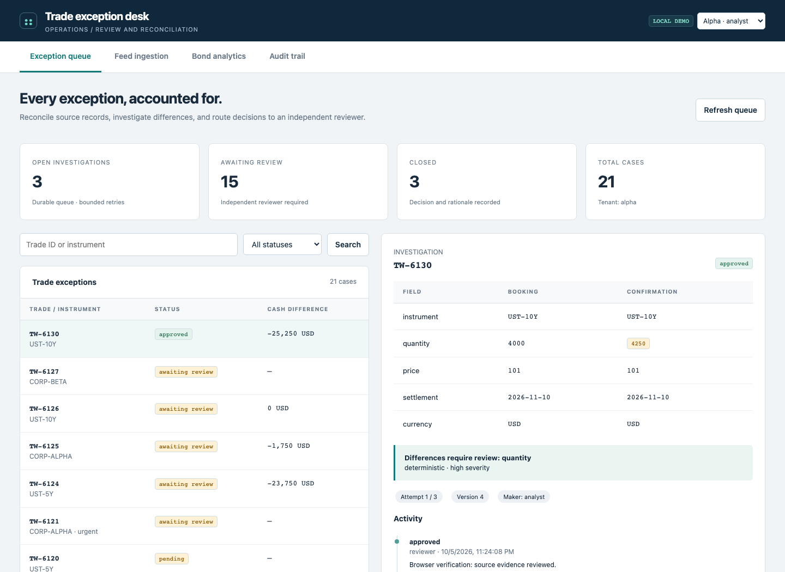

# Trade exception desk

[](https://github.com/christianwhollar/trade-exception-desk/actions/workflows/ci.yml)

An operations workbench for importing trade feeds, investigating disagreements, and recording an independent review. The browser shows both source records, deterministic cash differences, supporting policy passages, and the complete decision history.



## Start locally

Python 3.12 is the tested runtime. From this repository:

```bash
python3.12 -m venv .venv
source .venv/bin/activate
pip install -c constraints.txt -e '.[dev]'
python -m trade_desk.serve --demo
```

Open **http://127.0.0.1:8101**. Demo mode binds to loopback and exposes explicit analyst/reviewer identities for synthetic data. It is opt-in; use configured credentials for a hosted service. Interactive API documentation is at `/docs`.

## Walk through a case

1. Open **Feed ingestion**, load the example files, and import them. Schema errors and duplicate trade IDs reject the batch before writes. Missing counterparts are quarantined.
2. Open an exception in **Exception queue**. Compare the booking and confirmation, then run its investigation.
3. Add a note, owner, or priority. Updates use an expected version; a stale browser cannot silently overwrite another update.
4. Switch the demo identity to **Alpha · reviewer** and record a decision. The case maker cannot approve their own case.
5. Inspect **Audit trail** and export the tenant history. Try **Beta · analyst** to see tenant isolation.
6. Use **Bond analytics** to inspect dated cash flows, clean/dirty price, accrued interest, DV01, duration, and yield shocks.

## Engineering decisions

```mermaid
flowchart LR
  CSV[Validated feed pair] --> TX[Atomic import and idempotency]
  TX --> Queue[SQLite durable queue]
  Queue --> Lease[Token-fenced worker lease]
  Lease --> Checks[Deterministic reconciliation]
  Checks --> Policy[Optional policy retrieval]
  Policy --> Draft[Optional model commentary]
  Draft --> Review[Independent human review]
  Review --> Audit[Hash-linked tenant audit]
```



Financial comparisons use decimal arithmetic. A language model may draft commentary but cannot change computed differences, approve a case, or execute a trade. The dated bond calculator explicitly separates its cash-flow conventions from the currency-per-unit trade reconciliation convention.

Workers use 60-second leases, ownership tokens, and three attempts. A stale worker cannot finish a reclaimed case. Expired final-attempt leases become failed cases; an authorized reviewer can record a manual retry. Start the continuous worker with `--worker`.

The reliability study imported **512 booking rows**, opened **341 exceptions**, raced **12 workers**, rejected **40 duplicate executions** and **12 stale completions**, and verified the restored database against the original audit head. These are controlled local measurements, not a cloud throughput claim.

```bash
python -m trade_desk.reliability --output runtime/reliability.json
```

[Recorded reliability study](reports/reliability-v2.json) · [Financial and lifecycle tests](tests/test_workbench.py)

## Connect the other services

Start the evidence workbench and a live inference router, then set:

```bash
export SERVICE_TENANT=alpha
export EVIDENCE_URL=http://127.0.0.1:8102
export EVIDENCE_API_KEY=demo-analyst
export ROUTER_URL=http://127.0.0.1:8104
export ROUTER_API_KEY=demo-analyst
python -m trade_desk.serve --demo --worker
```

With the three demo services running and connected, `python scripts/check_connected.py` exercises ingestion, generation, investigation, review and access revocation using a synthetic case. It writes a verification report under `runtime/`.

The report preserves retrieved document/revision IDs. Model output must satisfy a JSON schema and cite the two source record names. If optional services fail, the deterministic investigation still completes with an explicit fallback marker. Commentary remains unverified prose for the reviewer.

## Deployment and boundaries

`docker compose up --build` starts the local seeded application on loopback. The image runs as UID 10001. Hosted deployments should run the unseeded `trade_desk.api:app`, configure real API keys, terminate TLS, and persist `/data`. This SQLite design targets one host; it is not a distributed trading engine.

Audit hashes detect edits against a retained chain. An externally retained head or trusted on-chain checkpoint is required to detect total rewrites or tail truncation. The optional Solidity `AuditAnchor` contract has local-EVM tests for ownership and monotonic checkpoints; no public chain deployment is claimed.

Bond pricing uses regular maturity-anchored coupons, ACT/365F discount times, nominal periodic yield and ACT/ACT coupon accrual. It does not implement holiday calendars, irregular stubs, accrued-interest market conventions for every security, or execution-quality pricing.


The live three-service verification passed with actual Ollama responses, authorized policy retrieval, independent review enforcement and settled usage reservations. [Recorded connected workflow](reports/integration-v2.json).

## Validation and project notes

```bash
pytest -q
ruff check src tests scripts
```

[Architecture and decisions](docs/design.md) · [Operating guide](docs/operations.md) · [Verification record](docs/verification.md) · [Development provenance](DEVELOPMENT.md)

This is a finished local portfolio application with reproducible experiments and recorded limitations. It does not claim prior production deployment or substitute for operating experience.
