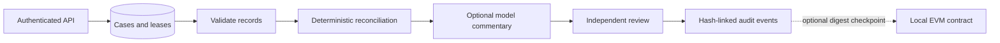

# Trade exception desk

[](https://github.com/christianwhollar/trade-exception-desk/actions/workflows/ci.yml)

Investigate mismatched trade records, explain the deterministic findings, and require an independent reviewer before closing a case. A LangGraph workflow coordinates validation, reconciliation, optional model commentary, and the review gate.

This is a runnable reference implementation using synthetic data. See [design notes](docs/design.md), [development provenance](DEVELOPMENT.md), and [verification](docs/verification.md).

## Run locally

Python 3.12 is the tested runtime.

```bash
python3.12 -m venv .venv
source .venv/bin/activate
pip install -c constraints.txt -e '.[dev]'
python -m trade_desk.demo
pytest -q
```

## What happens in the demo

Two synthetic records disagree on quantity and settlement date. The service calculates a cash difference of -9,912.50 USD using decimal arithmetic, records the evidence, and sends the case to review. A different user rejects the proposed resolution pending counterparty confirmation. No order is sent anywhere.



## API and worker

```bash
APP_DEMO=1 uvicorn trade_desk.api:app --host 127.0.0.1 --port 8101
# In another terminal, process pending jobs once:
python -m trade_desk.worker
```

Open `http://127.0.0.1:8101/docs`. Use bearer token `demo-analyst` to create or investigate cases and `demo-reviewer` to approve or reject them. These identities belong to tenant alpha; `demo-beta` belongs to a separate tenant. The sample request is in [examples/case.json](examples/case.json).

| Endpoint | Purpose |
|---|---|
| `POST /cases` | Create a case with an `Idempotency-Key` header |
| `POST /cases/{id}/investigate` | Claim a lease and execute the bounded workflow |
| `POST /cases/{id}/decision` | Independent human approval or rejection |
| `GET /audit` | Verify the tenant's event hash chain |
| `POST /pricing/bond` | Price a synthetic annual-coupon bond and recover its yield |
| `GET /metrics` | Authenticated Prometheus metrics |

The worker can be scheduled by a process supervisor. It polls a durable queue, retries failed work up to three attempts, and reaps expired final-attempt leases. API-driven execution and worker execution share the same lease checks.

## Feed ingestion and proactive case creation

```bash
python -m trade_desk.ingest --internal examples/internal.csv \
  --counterparty examples/counterparty.csv --tenant alpha
python -m trade_desk.worker
```

The importer validates both CSV feeds, skips matched pairs, opens discrepancies using content-derived idempotency keys, and quarantines unpaired records. Replaying unchanged feeds cannot create duplicate cases. This is a trusted local batch integration; the tenant flag is an operator setting, not an unauthenticated API override.

## Optional model commentary

Start [inference-router](https://github.com/christianwhollar/inference-router) with a real configured model, then set `ROUTER_URL` and `ROUTER_API_KEY` before starting this service. Commentary must satisfy a JSON schema and cite only the two supplied records. Failure falls back to the deterministic explanation. Model text cannot alter arithmetic, case status, or the approval gate. Valid citation identifiers do not establish factual entailment; a reviewer still checks the commentary.

## Containers and audit contract

```bash
docker compose up --build
pip install -e '.[chain]'
python -c 'import solcx; solcx.install_solc("0.8.30")'
RUN_CHAIN_TESTS=1 pytest tests/test_contract.py -q
```

The contract test compiles Solidity and deploys to an in-memory test chain. It checks owner-only anchoring, monotonic sequence numbers, and rejection of empty digests. It never uses a wallet or public blockchain.

## Boundaries

SQLite supports a single-node reference deployment, not a multi-region trading system. The audit chain detects changed events when its trusted head is available; a database administrator could rewrite the entire chain or truncate it. External checkpoints help establish a trusted head, but the contract is an optional component and is not automatically wired into the case API. Bond conventions intentionally omit calendars, accrued interest, and day-count rules. There is no real-money execution or claim of regulatory certification.
